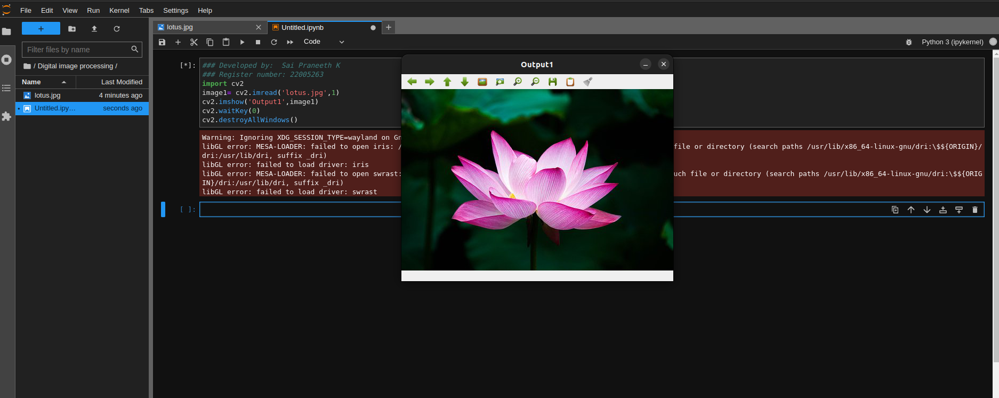
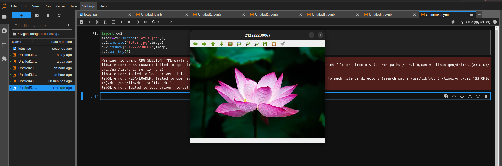
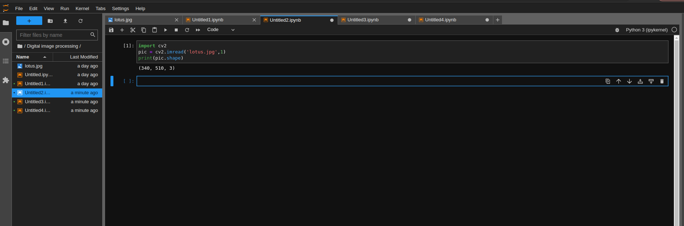
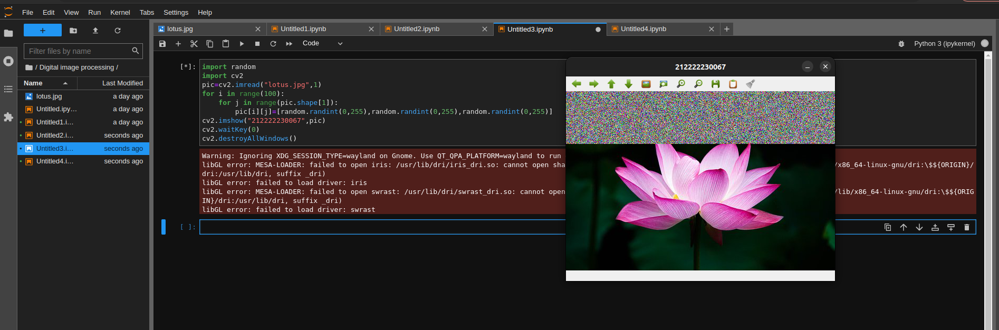
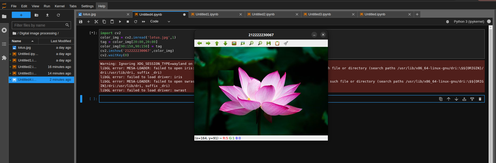

# READ AND WRITE AN IMAGE
## AIM
To write a python program using OpenCV to do the following image manipulations.
i) Read, display, and write an image.
ii) Access the rows and columns in an image.
iii) Cut and paste a small portion of the image.

## Software Required:
Anaconda - Python 3.7
## Algorithm:
### Step1:
Choose an image and save it as a filename.jpg
### Step2:
Use imread(filename, flags) to read the file.
### Step3:
Use imshow(window_name, image) to display the image.
### Step4:
Use imwrite(filename, image) to write the image.
### Step5:
End the program and close the output image windows.
## Program:
### Developed By:
### Register Number: 
i) #To Read,display the image
```python
  ### Developed by:  Sai Praneeth K
  ### Register number: 212222230067
  import cv2
  image1= cv2.imread('lotus.jpg',1)
  cv2.imshow('Output1',image1)
  cv2.waitKey(0)
  cv2.destroyAllWindows()

```
ii) #To write the image
```python
## Developed by:  Sai Praneeth K
### Register number: 212222230067
import cv2
image1= cv2.imread('lotus.jpg',0)
cv2.imshow('Output1',image1)
cv2.waitKey(0)
cv2.destroyAllWindows()
```
iii) #Find the shape of the Image
```python
## Developed by:  Sai Praneeth K
### Register number: 212222230067
import cv2
pic = cv2.imread('lotus.jpg',1)
print(pic.shape)
```
iv) #To access rows and columns

```python
## Developed by:  Sai Praneeth K
### Register number: 212222230067
import random
import cv2
pic=cv2.imread("lotus.jpg",1)
for i in range(100):
    for j in range(pic.shape[1]):
        pic[i][j]=[random.randint(0,255),random.randint(0,255),random.randint(0,255)]
cv2.imshow("212222230067",pic)
cv2.waitKey(0)
cv2.destroyAllWindows()
```
v) #To cut and paste portion of image
```python
## Developed by:  Sai Praneeth K
### Register number: 212222230067
import cv2
color_img = cv2.imread('lotus.jpg',1)
tag = color_img[20:80,20:80]
color_img[90:150,90:150] = tag
cv2.imshow('212222230067',color_img)
cv2.waitKey(0)
```

## Output:

### i) Read and display the image

### ii)Write the image

### iii)Shape of the Image

### iv)Access rows and columns

### v)Cut and paste portion of image

## Result:
Thus the images are read, displayed, and written successfully using the python program.


